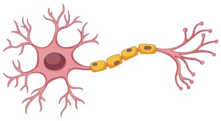

# Cálculo de una neurona genérica en Streamlit

Aplicación con Python y Streamlit "Neurona genérica" con las siguientes características:

- Vector de entrada
- Vector de pesos
- Sesgo
- Función de activación

En este enlace puedes probar la aplicación: 
https://sergiotoscanodiaz-streamlit-neurona-app-omz6w0.streamlit.app/
